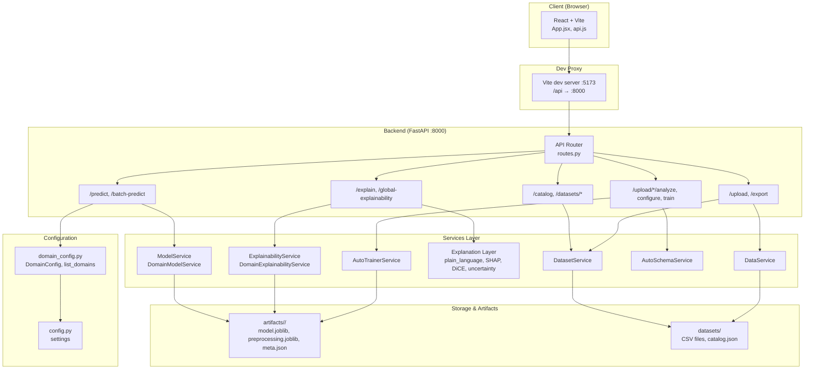

# PRISM — Human-Centred Explainable AI (XAI) System

An interactive explainable AI framework for decision support. PRISM combines **SHAP** (feature attributions) and **counterfactual** ("what-if") explanations in a human-centred interface.

---

## Table of Contents

- [Features](#features)
- [Prerequisites](#prerequisites)
- [Installation](#installation)
- [Running the Application](#running-the-application)
- [Usage Guide](#usage-guide)
- [Training Models](#training-models)
- [Project Structure](#project-structure)
- [Architecture](#architecture)
- [API & Endpoints](#api--endpoints)
- [Troubleshooting](#troubleshooting)
- [Notes](#notes)

---

## Features

- **Decision engine** — Black-box classifier with decision output and confidence
- **Explanation layer** — Decision factor contribution summaries, directional reasoning, plain-language bullets
- **SHAP view** — Technical bar chart of decision factor impacts (top 20)
- **Counterfactuals** — What-if suggestions that could flip the outcome
- **Uncertainty & stability** — Confidence bands, volatility checks, instability warnings
- **CSV upload** — Analyze catalog datasets or upload custom tabular data
- **Explanation modes** — Plain language / Technical / What-if
- **Interactive sliders** — Adjust decision factors and explore what-if scenarios
- **Saved cases** — Bookmark and revisit cases across sessions
- **Export** — CSV/PDF reports for auditability
- **Theme toggle** — Light and dark mode

---

## Prerequisites

- **Python 3.10+** (backend)
- **Node.js 18+** and **npm** (frontend)

---

## Installation

### 1. Clone the repository

```bash
git clone <repository-url>
cd prism_mvp
```

### 2. Backend setup

```bash
cd backend

# Create and activate virtual environment
python -m venv venv

# On macOS/Linux:
source venv/bin/activate

# On Windows (Command Prompt):
venv\Scripts\activate

# On Windows (PowerShell):
.\venv\Scripts\Activate.ps1

# Install dependencies
pip install -r requirements.txt
```

### 3. Train models (required before first run)

Pre-trained artifacts may be present. To train or retrain:

```bash
# Train all catalog datasets
python scripts/train_all_models.py

# Or train a specific domain (e.g. german_credit)
python scripts/train_all_models.py german_credit
```

### 4. Frontend setup

Open a new terminal:

```bash
cd frontend

# Install dependencies
npm install
```

---

## Running the Application

You need **both** the backend and frontend running.

### Terminal 1 — Backend

```bash
cd backend
source venv/bin/activate   # or Windows equivalent
PYTHONPATH=. uvicorn app.main:app --reload --port 8000
```

### Terminal 2 — Frontend

```bash
cd frontend
npm run dev
```

### Access

| Service | URL |
|---------|-----|
| **App** | http://localhost:5173 |
| **API** | http://localhost:8000 |
| **API docs** | http://localhost:8000/docs |

The frontend proxies `/api` requests to the backend, so use the app URL for normal use.

---

## Usage Guide

### 1. Select a dataset

- Use the **catalog** dropdown to choose a built-in dataset (e.g. UCI Credit Approval, German Credit, Heart Disease).
- Or click **Upload CSV** to analyze your own tabular data.

### 2. Explore rows

- Use the table or navigation controls to select a row.
- The **Decision engine** shows the predicted outcome and confidence for that row.

### 3. Understand explanations

- **Decision factors** — Which features influenced the decision and how.
- **Plain language** — Human-readable summaries.
- **Technical** — SHAP bar chart of feature impacts.
- **What-if** — Counterfactual suggestions and sliders to explore scenarios.

### 4. Save and revisit cases

- Click **★ Saved** to add the current case to your bookmarks.
- Click a saved case to load it (switches dataset if needed and scrolls to the explanation).

### 5. Export

- Use the export options to download CSV or PDF reports.

### 6. Theme

- Use the **theme toggle** in the header to switch between light and dark mode.

---

## Training Models

| Script | Purpose |
|--------|---------|
| `train_all_models.py` | Train models for all catalog domains |
| `train_model.py` | Train a single model (legacy/default) |

```bash
cd backend
source venv/bin/activate

# Train everything
python scripts/train_all_models.py

# Train one domain
python scripts/train_all_models.py german_credit
python scripts/train_all_models.py heart_disease
```

Artifacts are written to `backend/artifacts/<domain_id>/` (model.joblib, preprocessing.joblib, meta.json).

---

## Project Structure

```
prism_mvp/
├── backend/
│   ├── app/
│   │   ├── api/           # FastAPI routes
│   │   ├── models/        # Pydantic schemas
│   │   ├── services/      # Data, model, SHAP, DiCE, explanation layer
│   │   ├── config.py
│   │   ├── domain_config.py
│   │   └── main.py
│   ├── artifacts/         # Trained models (per domain)
│   ├── datasets/          # CSV files + catalog.json
│   ├── scripts/           # train_model.py, train_all_models.py
│   ├── app_data/          # Recent uploads metadata
│   └── requirements.txt
├── frontend/
│   ├── src/
│   │   ├── App.jsx
│   │   ├── api.js
│   │   └── main.jsx
│   └── package.json
└── README.md
```

---

High-level architecture of the PRISM application:



**Flow summary:**

| Layer | Components |
|-------|------------|
| **Client** | React SPA (Vite). Calls `/api/*`; dev server proxies to backend. |
| **API** | FastAPI router: catalog/datasets, upload/export, predict/explain, training. |
| **Services** | DataService, ModelService, DomainModelService, ExplainabilityService, Explanation Layer (SHAP, DiCE, plain language), DatasetService, AutoSchemaService, AutoTrainerService. |
| **Config** | `domain_config.py` (per-domain schema, labels, paths), `config.py` (app settings). |
| **Storage** | `artifacts/` (trained models per domain), `datasets/` (CSV + catalog). |

---

## API & Endpoints

Key endpoints (see http://localhost:8000/docs for full OpenAPI spec):

- `GET /api/catalog` — List available datasets
- `POST /api/upload` — Upload CSV
- `POST /api/predict` — Get prediction for a row
- `GET /api/explain` — SHAP / explanation data
- `POST /api/export` — Export CSV/PDF

---

## Troubleshooting

### Backend won't start

- Ensure Python 3.10+ is installed: `python --version`
- Ensure the virtual environment is activated and dependencies are installed
- Ensure port 8000 is not in use

### "Model not found" or prediction errors

- Run `python scripts/train_all_models.py` to train models for all domains
- Check that `backend/artifacts/<domain_id>/` contains `model.joblib` and `preprocessing.joblib`

### Frontend can't reach API

- Confirm the backend is running on port 8000
- The Vite dev server proxies `/api` to `http://127.0.0.1:8000` — ensure nothing blocks this

### Counterfactuals fail

- DiCE may not support all dataset schemas. SHAP and the decision engine still work; counterfactuals are optional.

### CORS errors

- The backend should allow requests from the frontend origin. Check `config.py` / CORS settings if you change ports.

---

## Notes

- **Terminology:** model.predict → **decision engine**; accuracy → **confidence**; features → **decision factors**
- **Schema:** Catalog datasets have predefined schemas. Custom uploads use auto-detection where supported
- **Multi-domain:** PRISM supports multiple domains (Finance, Healthcare, Education, Employment, Insurance, Legal) with domain-specific models and explanations
